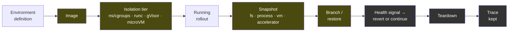

# Agent Environment Sandbox

**From an environment definition to a rollout that can be paused, branched, reverted and torn
down. One runbook per phase, and every hop says whether it was run or only specified.**

`SE-` is the project prefix of [The Scrappy Engineer](https://linkedin.com/in/vicenteliu), the
author's channel; this is the second `SE-` project, after
[macOS Endpoint Automation](https://github.com/vicenteliu/SE-macOS-Endpoint-Automation). It is a
playbook — not a vendor tutorial, and not a case study. It publishes no employer and no client;
[DISCLOSURE.md](DISCLOSURE.md) says where that line sits and why.

## Why this exists

It was written against the requirements of **one role in the AI-environment lane** — the execution
layer beneath agent and reinforcement-learning environments, on on-prem hardware — after the author
had said in writing that sandbox and isolation tooling was work he could take on. A sentence like
that needs something behind it. So: the whole chain specified end to end, **run wherever the author
could run it and marked wherever he could not**. It is not a claim of scale. The runs here are on
one machine; the specifications say which tier of hardware would be needed to verify the rest. It
continues regardless of how that conversation ends, and it is written for the next role in the same
family: one repository per job family, the company-specific layer kept private.

The repository was built with AI-assisted development. The architecture, the runs, and every
marker below are the author's; the tooling accelerated the writing and the reading of manuals.

| If you have… | Read |
|---|---|
| **five minutes** | the [footing table](#where-the-author-stands) below, then [the chain](#the-chain), then [phase 2](phases/2-snapshot-branch/) — the page where a running process is checkpointed once and restored twice |
| **fifteen** | [the chain, hop by hop](docs/00-the-chain.md), then [phase 1](phases/1-isolation/) — three isolation tiers under the same workload, with the overhead of each |
| **a platform to build** | the runbooks in order, [1](phases/1-isolation/) → [6](phases/6-observability/); the [isolation selection](docs/01-isolation-selection.md) first if the question is *which tier* |
| **someone to explain it to** | [EXPLAIN.md](EXPLAIN.md) — the same chain with zero jargon |
| **a model you want to hand part of this to** | [AGENT_BOUNDARY.md](AGENT_BOUNDARY.md) — per responsibility of the *operator's* agent, what a person decides and what a model executes, with the model and the date on every row that was actually tried |

---

## Where the author stands

Markers, not adjectives. The legend is [below](#honesty-markers); the test behind every line is
*"walk me through a time you did this, in detail — would it hold?"*

| Marker | Claim |
|---|---|
| 🔨 | **Containers in production** as an operator — images, registries, packaging pipelines, for years |
| 🔨 | **Virtualisation with GPU passthrough** — KVM / Proxmox, physical GPUs assigned to VMs, in a lab the author built |
| 🔨 | **Filesystem snapshots** — ZFS-backed VM storage; knows which layer a snapshot lands on and why that matters |
| 🔨 | **Models on on-prem hardware** — single-GPU and single-machine deployments, up to a large quantised model |
| 🔨 lab | **Isolation by hand** — namespaces and cgroups without a container engine, then a runtime, then gVisor; *run in this repository's lab* |
| 🔨 lab | **Checkpoint, restore, branch** — one running process, checkpointed once, restored twice into diverging histories; *run in this repository's lab* |
| 🧭 | **Execution at scale** — scheduling, cost-per-rollout, startup-to-teardown profiling: specified, not operated |
| 🧭 | **Failure detection and revert** — the loop over phase 2's branches: specified |
| 🧭 | **Observability across many rollouts** — specified |
| ⛔ | **microVM isolation (Firecracker)** — specified with a lab tier that can run it; not run here, because it needs KVM and the author's lab has none |
| ⛔ | **Accelerator state in a snapshot** — the hardest tier of phase 2; specified, and the reason it is not run is stated |

**Not claimed anywhere in this repository:** distributed systems at scale, cloud platforms as an
operator, a systems language as a trade. See [DISCLOSURE.md](DISCLOSURE.md).

## Honesty markers

Inherited from [`sysadmin-self-cultivation`](https://github.com/vicenteliu/sysadmin-self-cultivation)'s
ADR-0003 and [SE-macOS-Endpoint-Automation](https://github.com/vicenteliu/SE-macOS-Endpoint-Automation)'s ADR-0001.

| | Means |
|---|---|
| 🔨 | **Operated for real**, with consequences. Survives a deep follow-up question. |
| 🔨 lab | **Run in this repository's lab tier** — real commands, real output, one machine. Not production, and the page says so. |
| 🧭 | **Verified ramp** — mapped and doc-checked. Not run. |
| ⛔ | **Specced-Not-Run** — a complete environment spec, verification steps and acceptance criteria, **deliberately not executed, with the reason stated** ([ADR-0001](docs/adr/0001-specced-not-run-is-a-third-marker.md)). |

## The chain

🟨 run in the lab tier · ⬛ specified · the microVM and accelerator hops inside C and E are 🟥 specced, not run

## Phases

| Phase | | State |
|---|---|---|
| 1 | [Isolation tiers](phases/1-isolation/) | 🔨 lab — three tiers, one workload, overhead measured · ⛔ microVM |
| 2 | [Snapshot, restore, branch](phases/2-snapshot-branch/) | 🔨 lab — filesystem and process; · 🧭 VM · ⛔ accelerator |
| 3 | [Execution at scale](phases/3-execution-at-scale/) | 🧭 |
| 4 | [Failure, revert, continue](phases/4-failure-revert/) | 🧭 |
| 5 | [Environment spec, packaging, models](phases/5-spec-packaging-models/) | 🔨 lab — packaging and a model endpoint · 🧭 spec format |
| 6 | [Observability and trace debugging](phases/6-observability/) | 🧭 |

Each phase is a **Runbook** in six sections: prerequisites · the hops · how the phase fails ·
verification (a row per hop, with the command and the expected output wherever a lab tier can
produce one) · one acceptance · one escape hatch.

## Inheriting a platform

Not written yet. It is [first in TODO.md](TODO.md) for the same reason it was first in the
previous playbook: it is the page that makes this a playbook rather than a description of a chain.
